This advanced guide dives into detailed aspects of finetuning XTTS models, covering everything from preparing high-quality audio data to managing memory, optimizing training parameters, and troubleshooting common issues. Use the table of contents below to navigate each section.

Please refer to Coqui's Documentation & Forums for anything not covered here https://docs.coqui.ai/en/latest/index.html

## Table of Contents

1. [Preparing High-Quality Audio Data](#preparing-high-quality-audio-data)
   - [Quality Requirements](#1-quality-requirements)
   - [Format Requirements](#2-format-requirements)
   - [Content Selection](#3-content-selection)
   - [Pre-processing Recommendations](#4-pre-processing-recommendations)

2. [Memory Management and Optimization](#memory-management-and-optimization)
   - [VRAM and System RAM Usage](#1-vram-and-system-ram-usage)
   - [Optimization Strategies](#2-optimization-strategies)
   - [Signal Handling and Safe Interruptions](#3-signal-handling-and-safe-interruptions)
   - [Common Memory Issues and Solutions](#3-common-memory-issues-and-solutions)

3. [Advanced Training Parameters](#advanced-training-parameters)
   - [Epochs](#1-epochs)
   - [Batch Size and Gradient Accumulation](#2-batch-size-and-gradient-accumulation)
   - [Learning Rate and Schedulers](#3-learning-rate-and-schedulers)
   - [Optimizer Options](#4-optimizer-options)

4. [Advanced Model Features and Configuration](#advanced-model-features-and-configuration)
   - [Byte-Pair Encoding (BPE) Tokenization](#1-byte-pair-encoding-bpe-tokenization)
   - [Multiple Voice Training](#2-multiple-voice-training)
   - [Custom Training Configurations](#3-custom-training-configurations)

5. [Understanding Model Training Results](#understanding-model-training-results)
   - [Simple Explanation of Key Metrics](#1-simple-explanation-of-key-metrics)
   - [Detailed Explanation of Training Metrics](#2-detailed-explanation-of-training-metrics)
   - [Recognizing Overtraining](#3-recognizing-overtraining)
   - [Best Model Saves](#4-best-model-saves)

6. [Troubleshooting Common Issues](#troubleshooting-common-issues)
   - [Out of Memory Errors](#1-out-of-memory-errors)
   - [Slow Training Performance](#2-slow-training-performance)
   - [Poor Quality Output](#3-poor-quality-output)
   - [Training Instability and Overfitting](#4-training-instability-and-overfitting)
   - [Model Detection Issues](#5-model-detection-issues)
   - [Additional Tips for Monitoring and Debugging](#6-additional-tips-for-monitoring-and-debugging)

7. [Understanding Local and Global Minima in Model Training](#understanding-local-and-global-minima-in-model-training)
   - [What Are Local and Global Minima?](#1-what-are-local-and-global-minima)
   - [Impact on Model Training](#2-impact-on-model-training)
   - [Strategies for Managing Minima](#3-strategies-for-managing-minima)

8. [Understanding Debug Output](#understanding-debug-output)
   - [Dataset Creation Debug Output](#dataset-creation-debug-output)
   - [Training Debug Output](#training-debug-output)

9. [Finetune Flowchart](#finetune-flowchart)
---

# Preparing High-Quality Audio Data

Preparing high-quality audio data is essential for creating a clear and accurate Text-to-Speech (TTS) model. This guide covers recommended audio specifications, content guidelines, and pre-processing tips to help you get the best performance from your finetuned model.

## Table of Contents
1. [Quality Requirements](#quality-requirements)
2. [Format Requirements](#format-requirements)
3. [Content Selection](#content-selection)
4. [Pre-processing Recommendations](#pre-processing-recommendations)

---

### 1. Quality Requirements

High-quality audio ensures the model learns to produce clear, natural-sounding speech. Low-quality audio with noise, inconsistencies, or distortion can negatively impact model performance.

**Recommended Audio Quality**:
- **Minimum Length**: 3 minutes total; however, 5+ minutes is recommended for better accuracy.
- **Clear Speech**: Ensure the audio has minimal background noise and consistent volume levels.
- **Room Characteristics**: Minimize reverb or echo, as these can interfere with model training.

**Why Audio Quality Matters**:
- Noise and background interference confuse the model, leading to inconsistent outputs.
- Variations in volume can make it harder for the model to generalize and replicate a consistent speaking tone.
- Clean audio provides a more accurate representation of voice characteristics, resulting in clearer synthesis.

---

### 2. Format Requirements

The finetuning process accepts various audio formats, but certain formats and settings are preferred for optimal results.

**Supported Formats**:
- **File Types**: MP3, WAV, or FLAC
- **Sample Rate**: Any sample rate is acceptable, as the finetuning script will process it automatically.
- **Channels**: Both single-channel (mono) and dual-channel (stereo) audio are supported.

**Suggested Settings**:
- **WAV Format**: For best quality, consider using WAV files with a sample rate of 16 kHz or higher and a bit depth of 16 bits.
- **FLAC Format**: FLAC is an alternative if you need smaller file sizes without sacrificing quality.

Using a consistent format throughout your dataset can help maintain uniform quality and reduce variability.

---

### 3. Content Selection

Content selection is crucial for capturing the full range of vocal characteristics. A well-prepared dataset should include varied content to help the model learn to replicate different tones, emotions, and pronunciation nuances.

**Suggested Content Types**:
- **Varied Sentence Lengths**: Include short and long sentences to teach the model different pacing styles.
- **Diverse Tones and Emotions**: Add recordings with different emotions and tones to improve the model's expressive range.
- **Mixed Speaking Speeds**: Use a combination of fast and slow speech to help the model understand different cadences.
- **Phonetic Variety**: Cover a broad set of phonemes (speech sounds) to enhance pronunciation and clarity across different words and sounds.

**Example Content Mix**:
- Neutral sentences for baseline tone
- Questions and exclamations for emotional range
- Phrases with names, dates, and numbers to capture pronunciation patterns

---

### 4. Pre-processing Recommendations

Pre-processing audio data ensures consistent quality across the dataset, reducing noise and improving clarity for finetuning. Here are some steps to prepare audio files effectively:

1. **Remove Background Noise**:
   - Use audio editing software (e.g., Audacity or Adobe Audition) to remove any consistent background sounds & other speakers.
   - Focus on eliminating hums, hisses, or any static that could interfere with the model's ability to distinguish voice characteristics.

2. **Split Long Files**:
   - If you have long recordings (e.g., interviews or lectures), consider splitting them into shorter segments. This helps the model process each segment more efficiently and reduces memory usage, though the dataset generation process will split the audio down.
   - The finetuning script can handle segmentation automatically, but manually splitting files may provide better control over segment quality.

3. **Remove Non-Speaker Sounds**:
   - Ensure that the audio contains only the target speaker’s voice. Remove background voices, interviewer questions, or any non-speaker sounds if using multi-speaker recordings.
   - If using audio from interviews, focus on responses and cut out interviewer questions.

4. **Normalize Volume Levels**:
   - Adjust volume levels across all files to ensure consistency. This helps the model avoid learning unintended variations in loudness.
   - Use normalization settings in audio software to balance the audio levels throughout the dataset.

5. **Remove Unnecessary Audio Effects**:
   - Avoid music, special effects, or excessive reverb. Simple, clear speech data allows the model to learn the speaker’s natural voice more effectively.

---

# Memory Management and Optimization

Managing memory effectively is critical for successful model finetuning, especially on systems with limited VRAM. This page covers memory optimization techniques, differences between Windows and Linux memory handling, and troubleshooting for common memory issues.

## Table of Contents
1. [VRAM and System RAM Usage](#vram-and-system-ram-usage)
2. [Optimization Strategies](#optimization-strategies)
3. [Signal Handling and Safe Interruptions](#signal-handling-and-safe-interruptions)
4. [Common Memory Issues and Solutions](#common-memory-issues-and-solutions)

---

### 1. VRAM and System RAM Usage

**VRAM** (Video RAM) and **System RAM** usage can impact training efficiency and determine the maximum batch size and model configuration.

#### Windows Memory Handling
On Windows, the system can use additional RAM to supplement VRAM, which is helpful if your GPU has limited memory:
- **12GB VRAM** cards require an additional 2GB of system RAM.
- **8GB VRAM** cards require approximately 6GB of system RAM.
- **6GB VRAM** cards may need up to 8GB of system RAM for efficient operation.

#### Linux Memory Handling
On Linux, only physical VRAM is used during training, so higher VRAM (e.g., 16GB+) is recommended for reliable operation. Linux systems do not use system RAM as VRAM, so you may need to adjust batch size and gradient accumulation to fit within the physical VRAM limits.

---

### 2. Optimization Strategies

These strategies help minimize memory usage and optimize training speed, especially for VRAM-limited environments.

#### Reducing Memory Usage
1. **Lower Batch Size**: Decrease the batch size to fit within available VRAM.
2. **Increase Gradient Accumulation**: Use gradient accumulation to simulate larger batch sizes without exceeding VRAM limits. 
   - **Example**: Set `batch_size` to 8 and `gradient_accumulation_steps` to 4 to achieve an effective batch size of 32.
3. **Limit Worker Threads**: Set the number of worker threads for data loading to a level your system can handle efficiently, usually between 2–4. Too many threads can lead to memory spikes.
4. **Restrict Audio Length**: Shorter audio samples use less memory and improve data loading times, so consider splitting long audio files.

#### Improving Efficiency
1. **Optimal Batch Size for Hardware**: Use the largest batch size that fits within your VRAM limits, as larger batches generally make more efficient use of GPU resources.
2. **Shared Memory Limitation**: On some systems, limiting shared memory can improve memory allocation. 
3. **Regular Monitoring**: Use tools like `nvidia-smi` (for NVIDIA GPUs) to monitor GPU memory usage in real time. This helps identify if adjustments are needed mid-training.

---

### 3. Signal Handling and Safe Interruptions

The finetuning script is configured to handle interruptions gracefully, which is useful if you need to stop training manually. The system includes signal handling to prevent data corruption and allows for a clean shutdown.

**How to Safely Interrupt Training**:
- If using the GUI, select the stop option.
- For command-line interruptions, use standard keyboard interrupts like `CTRL+C`.

This approach ensures that training stops safely without corrupting the model’s current state or checkpoint.

---

### 4. Common Memory Issues and Solutions

Memory issues are common when finetuning large models on limited hardware. Here are typical issues and solutions to help address them.

#### Issue: Out of VRAM
**Symptom**: You see an error message similar to `CUDA out of memory`.
**Solutions**:
   - Reduce batch size.
   - Increase gradient accumulation steps.
   - Lower the number of worker threads.
   - Limit the maximum audio length to prevent large memory spikes.

#### Issue: System RAM Overload (Windows)
**Symptom**: The system becomes unresponsive, or you see an error indicating memory allocation failure.
**Solutions**:
   - Close unnecessary applications to free up system RAM.
   - Monitor memory usage with tools like Task Manager to identify memory leaks or other issues.
   - Consider reducing batch size if the VRAM-RAM configuration is causing issues.

#### Issue: Slow Data Loading
**Symptom**: Training slows down significantly due to data loading delays.
**Solutions**:
   - Decrease the number of worker threads.
   - Shorten audio sample lengths to reduce processing time.
   - Ensure that audio files are stored on a fast storage device (e.g., SSD rather than HDD) for optimal data loading speeds.

#### Additional Tips
- **Check for GPU Memory Fragmentation**: Restart training if you notice fragmentation from long sessions, as this can sometimes free up memory.
- **Garbage Collection in PyTorch**: The script utilizes Python’s `gc` (garbage collection) module to manage memory, so let it run automatically to help prevent memory leaks.

---

# Advanced Training Parameters

This page provides a deep dive into the parameters that control the training process for XTTS models. Adjusting these parameters can significantly impact training speed, memory usage, and model quality. Use this guide to understand each parameter and select settings that best suit your needs.

## Table of Contents
1. [Epochs](#epochs)
2. [Batch Size and Gradient Accumulation](#batch-size-and-gradient-accumulation)
3. [Learning Rate and Schedulers](#learning-rate-and-schedulers)
4. [Optimizer Options](#optimizer-options)

---

### 1. Epochs

An **epoch** represents one complete pass through your entire dataset. The number of epochs affects how thoroughly the model learns from the data. Generally, more epochs improve accuracy, but excessive training can lead to overfitting.

**Recommended Epoch Settings**:
- **Standard Voices**: 10-15 epochs
- **Accents/Dialects**: 15-20 epochs
- **Stylized/Cartoon Voices**: 20-30 epochs
   * These voices often need more training to capture unique characteristics
   * Monitor training graphs - continue if loss is still decreasing
   * Consider using gradient accumulation to simulate larger batch sizes
   * May benefit from lower learning rates (1e-6 to 5e-6) for fine detail
- **New Languages or Stylized Voices**: May require 100+ epochs for adequate training (according to Coqui's forum discussions)

**Choosing the Right Epoch Count**:
- **Dataset Size**: Smaller datasets may require more epochs, while large datasets may reach accuracy faster.
- **Voice Complexity**: Complex, stylized voices or those with unique accents often benefit from additional epochs.
- **Goal**: If your goal is basic voice reproduction, use a lower count. For a precise match to a specific voice, increase the epochs gradually while monitoring performance.

**Monitoring for Overfitting**: Watch the loss values (e.g., text loss, mel loss) to ensure they’re steadily decreasing. If they start to plateau or increase, this may signal overfitting. Consider stopping early or reducing epochs in this case.

---

### 2. Batch Size and Gradient Accumulation

**Batch Size** controls the number of samples processed simultaneously during training. Larger batch sizes make efficient use of hardware but require more memory. Smaller batches use less memory but may produce noisier updates.

**Batch Size Recommendations**:
- **Small Batch Size (5-10)**: Requires less memory, may help models escape local minima by adding training noise. Best for limited VRAM.
- **Medium Batch Size (10-20)**: Good balance of efficiency and memory usage. Recommended for most setups.
- **Large Batch Size (20-??)**: Maximum efficiency for hardware with sufficient VRAM, but requires more memory and can make models converge on sharper minima, which may impact generalization.

**Gradient Accumulation**:
If VRAM is limited, gradient accumulation allows you to simulate a larger batch size by dividing the effective batch into smaller portions. Each subset accumulates gradients until the effective batch size is reached, allowing updates without exceeding VRAM.

**Example**: To simulate a batch size of 32 with limited VRAM:
   ```python
   batch_size = 8
   gradient_accumulation_steps = 4  # Effective batch size = 8 * 4 = 32
   ```

---

### 3. Learning Rate and Schedulers

The **learning rate** controls how quickly the model learns. A high rate speeds up learning but risks missing finer details, while a low rate allows more precise adjustments but may slow training.

**Recommended Learning Rates**:
- **Stable and Slow (1e-6 to 5e-6)**: Good for cases where you want precise tuning.
- **Balanced (1e-5)**: Default for most cases, offering a mix of speed and stability.
- **Fast but Potentially Unstable (1e-3 and higher)**: Only use if you’re willing to monitor closely for instability.

**Learning Rate Schedulers**:
Schedulers adjust the learning rate during training to optimize results. Below are common types:

1. **Cosine Annealing with Warm Restarts**:
   - Reduces the learning rate in cycles to explore different minima.
   - Ideal for long training runs where you want the model to avoid settling on a local minimum.
   - Visual Representation:
     ```
     Learning Rate
          ^
     η_max|   /\    /\    /\
          |  /  \  /  \  /  \
          | /    \/    \/    \
     η_min|_____________________> Time
     ```

2. **Step Decay**:
   - Reduces the learning rate at set intervals (steps) to improve training stability.
   - Use this when you know at what points the learning rate should decrease.
   - Visual Representation:
     ```
     Learning Rate
          ^
     η_max|----+
          |    |
          |    +----+
     η_min|         +---- Time
     ```

3. **Exponential Decay**:
   - Gradually reduces the learning rate over time.
   - Good for a smooth decrease without sudden changes.
   - Visual Representation:
     ```
     Learning Rate
          ^
     η_max|\    
          | \
          |  \
     η_min|   \___> Time
     ```

---

### 4. Optimizer Options

Optimizers adjust the model’s weights based on the loss during training. Each optimizer has unique strengths, but **AdamW** is generally the recommended choice for XTTS.

1. **AdamW (Default)**:
   - Best all-around optimizer with adaptive learning and weight decay.
   - Good for general use and stable results with minimal tuning.

2. **SGD with Momentum**:
   - Traditional optimizer with potential for excellent results with careful tuning.
   - Requires scheduling for learning rate adjustments to perform effectively.

3. **RMSprop**:
   - Adapts learning rates per parameter, ideal for complex gradient patterns.
   - Good for specialized cases, particularly where standard optimizers struggle.

4. **Adam**:
   - Similar to AdamW but lacks weight decay.
   - Good fallback option if you encounter issues with AdamW.

**Recommended Settings**:
   ```python
   # Example configuration for high-quality training
   config = {
       'optimizer': 'AdamW',
       'learning_rate': 1e-5,
       'batch_size': 8,
       'gradient_accumulation_steps': 4,
       'scheduler': 'CosineAnnealingWarmRestarts'
   }
   ```

---

# Advanced Model Features and Configuration

This page provides an in-depth look at advanced XTTS model features, including Byte-Pair Encoding (BPE) tokenization, multiple voice training, and custom training configurations for specialized use cases.

## Table of Contents
1. [Byte-Pair Encoding (BPE) Tokenization](#byte-pair-encoding-bpe-tokenization)
2. [Multiple Voice Training](#multiple-voice-training)
3. [Custom Training Configurations](#custom-training-configurations)

---

### 1. Byte-Pair Encoding (BPE) Tokenization

Byte-Pair Encoding (BPE) is a tokenization technique that breaks text into subword units, making it easier for the model to handle unique or complex words, accents, and phonetic variations.

**Benefits of BPE Tokenization**:
- **Handles Unknown Words**: Breaks down uncommon words, allowing the model to learn parts of words it hasn’t encountered before.
- **Improves Accuracy with Accents and Dialects**: By encoding subword units, the model can better capture pronunciation nuances found in accents or dialects.
- **Supports Multi-Language Training**: BPE helps the model generalize across languages by creating shared subword representations.

**How BPE Works**:
   - The text is initially broken down into individual characters.
   - Frequently occurring character pairs are merged iteratively until reaching a predefined vocabulary size.
   - Each subword becomes a token that the model learns to recognize and reproduce.

**Example**:
   ```
   Input Text: "hello"
   BPE Tokens: ['he', 'll', 'o']
   ```

**XTTS Implementation**:
   - XTTS models use a specialized tokenizer with support for multiple languages and unique speech patterns.
   - The script also includes options to customize token frequency thresholds, vocabulary size, and stop tokens.

---

### 2. Multiple Voice Training

Training a model with multiple voices can add flexibility, allowing a single model to replicate various speaking styles. This section covers best practices for managing multiple voices in one model.

**Sequential Training Process**:
1. **Initial Voice Training**:
   - Start with a base model and finetune it on the first voice.
   - Export the trained model as a checkpoint.

2. **Additional Voices**:
   - Use the checkpoint from the previous training as a base.
   - Finetune the model with the new voice data, gradually adapting it to recognize multiple speakers.
   
3. **Balancing Training Time**:
   - Divide training time across voices for even quality.
   - Monitor each voice to ensure the model maintains quality for all trained voices.

**Best Practices**:
   - **Verify Quality**: Test outputs for each voice to ensure consistent quality.
   - **Avoid Overfitting to One Voice**: Distribute training epochs evenly across voices, especially if voices have different speaking styles or tones.
   - **Choose Similar Voice Types**: When possible, train voices with similar characteristics together to minimize conflicts in learned patterns.

---

### 3. Custom Training Configurations

Customizing training configurations allows you to tailor the model for unique datasets or specific applications. Here are some advanced customization options available in XTTS:

**Vocabulary and Token Frequency**:
   - **Vocabulary Size**: Adjust the vocabulary size based on the complexity and diversity of the dataset. Larger vocabularies capture more nuance but require more memory.
   - **Token Frequency Thresholds**: Modify thresholds to control which subwords are included in the vocabulary, filtering out less common tokens if desired.

**Scheduler and Optimizer Adjustments**:
   - Experiment with different schedulers and optimizers (e.g., **Cosine Annealing** for long training runs or **Exponential Decay** for smoother training).
   - Fine-tune hyperparameters for your specific dataset and hardware to maximize efficiency and minimize overfitting.

**Custom Loss Functions**:
   - XTTS models can be customized with different loss functions to emphasize specific aspects of training, such as focusing more on pronunciation or tone.

**Dataset and Tokenization Settings**:
   - XTTS supports custom tokenizers and datasets, allowing you to train on specialized vocabularies, accents, or even fictional languages.
   - **Example**: For datasets with heavy accents, set up a customized BPE tokenizer to capture specific phonetic details unique to that accent.

**When to Use Custom Configurations**:
   - Training models on non-standard languages, specialized vocabularies, or multiple accents.
   - Adapting models for high-precision applications, such as specific corporate or educational voice tones.
   - Expanding the model’s phonetic range by including custom datasets with unique phonemes or speaking patterns.

---

# Understanding Model Training Results

When training a Text-to-Speech (TTS) model, it's important to know if the model is improving with each round of training or if it’s no longer benefiting from additional training. Below is a guide on how to read the training output, recognize signs of improvement, and spot potential issues like overtraining. We’ll start with a simple explanation and then provide a more detailed, technical breakdown for those interested.

## Simple Explanation

Each time the model completes a training step, you'll see an **EVAL PERFORMANCE** section in the output with values that indicate how well the model is doing. Here’s what the key metrics mean:

- **Loader Time:** This shows how fast the data is being fed into the model. It’s more about the efficiency of the training process than the model’s actual performance, so lower values are usually better but not critical.

- **Loss Values:** These are the main numbers to watch, as they measure the model’s "mistakes." Lower loss values mean fewer mistakes, so we want these numbers to decrease over time. There are three types of losses:
  - **Text Categorical Cross-Entropy Loss (text_ce):** How well the model understands the text.
  - **Mel Spectrogram Loss (mel_ce):** How well the model creates sound patterns (spectrograms) from text.
  - **Average Loss:** A combination of the above, giving an overall view of the model’s performance.

### Example of Good Training Progression

Imagine the following **EVAL PERFORMANCE** output after each epoch:

| Epoch | Text Loss (text_ce) | Mel Loss (mel_ce) | Average Loss |
|-------|----------------------|-------------------|--------------|
| 1     | 0.020               | 4.5              | 4.0          |
| 2     | 0.015               | 3.8              | 3.5          |
| 3     | 0.012               | 3.2              | 3.0          |
| 4     | 0.010               | 3.0              | 2.8          |

**What to Notice:** In this example, all the loss values are steadily decreasing after each epoch, which suggests the model is learning and improving. If you see this trend, the training is progressing well, and the model is likely becoming more accurate.

### Example of Overtraining

Sometimes, training continues even though the model has stopped improving. Here’s what that might look like:

| Epoch | Text Loss (text_ce) | Mel Loss (mel_ce) | Average Loss |
|-------|----------------------|-------------------|--------------|
| 5     | 0.009               | 2.9              | 2.7          |
| 6     | 0.009               | 3.0              | 2.8          |
| 7     | 0.010               | 3.1              | 2.9          |

**What to Notice:** Here, the model's performance has plateaued after epoch 5, and even worsened slightly by epoch 7. This is a sign that additional training might not be beneficial and could even harm the model's ability to generalize to new data (overtraining). Stopping training here would be a good idea.

---

## Detailed Explanation

For users who want a deeper look at the numbers, let’s examine each part in detail.

### 1. Epoch and Global Step

Each **epoch** is a full pass through the training data. The "global step" represents progress within an epoch. For example, if you see:

```
Epoch: 3/4  Step: 7/31
```

This means you're on the 3rd epoch out of 4 total, and the model is on the 7th step out of 31 steps for this epoch. Watching these can give you a sense of the progress during each training phase.

### 2. Loss Values Explained in Detail

- **Text Cross-Entropy Loss (text_ce):** This checks the model’s understanding of the input text. For instance, if the model starts with a `text_ce` of `0.025` and decreases to `0.015` over time, it’s learning to interpret the text better. This decrease suggests that the model is getting better at converting text into features that will eventually be used to generate speech.

- **Mel Spectrogram Loss (mel_ce):** This is about the quality of the audio representation. Imagine starting with a `mel_ce` of `5.0` in the first epoch, and after training, it decreases to `3.0`. This drop indicates the model is producing more accurate sound representations of the text, essential for creating good TTS output.

- **Average Loss:** This is a weighted combination of the other losses and serves as a general health check on the model’s performance. In many cases, it’s the primary value to monitor. 

   For instance, if you see:
   
   ```
   Average Loss: 4.0 -> 3.5 -> 3.2 -> 3.0
   ```
   
   The downward trend shows steady improvement. But if it stabilizes or starts increasing, it might be time to stop training.

### 3. Recognizing Overtraining (or Overfitting)

Overtraining occurs when the model starts to "memorize" the training data rather than learning patterns that generalize to new data. Here’s an example of what this might look like:

| Epoch | Text Loss (text_ce) | Mel Loss (mel_ce) | Average Loss |
|-------|----------------------|-------------------|--------------|
| 1     | 0.025               | 5.0              | 4.5          |
| 2     | 0.020               | 4.3              | 3.8          |
| 3     | 0.018               | 3.9              | 3.5          |
| 4     | 0.018               | 3.8              | 3.5          |
| 5     | 0.018               | 3.9              | 3.6          |

**What to Notice:** From epoch 3 to epoch 5, the loss values have stopped decreasing and even start to increase slightly in epoch 5. This suggests the model isn’t learning anything new from the data and might be overfitting. Continuing training at this point might cause the model to perform well on training data but poorly on new data.

### 4. Best Model Saves

In the output, you’ll often see lines like:

```
BEST MODEL = E:/path/to/model_file.pth
```

This indicates the model has reached a new "best" performance for the loss values, and it saves a copy of the model at this point. If the model hasn’t saved a new "best" for several epochs, it might be a signal that it’s reached its peak performance.

### What to Do if Overtraining is Detected

If you notice that loss values are no longer decreasing or start increasing:

1. **Early Stopping:** Stop training if there’s no improvement after a few epochs.
2. **Use Regularization:** Techniques like dropout can help prevent overfitting by randomly "turning off" parts of the model during training, encouraging it to generalize better.
3. **Adjust Learning Rate:** Lowering the learning rate can help the model make finer adjustments without overfitting.

By monitoring these values, you can ensure the model is improving meaningfully and stop training when it’s no longer beneficial. This approach helps create a robust TTS model that performs well on new, unseen data. 

---

# Troubleshooting Common Issues

This page provides solutions to the most frequent problems encountered during XTTS model training. Use this guide to quickly identify, diagnose, and resolve issues, keeping your training process smooth and efficient.

## Table of Contents
1. [Out of Memory Errors](#out-of-memory-errors)
2. [Slow Training Performance](#slow-training-performance)
3. [Poor Quality Output](#poor-quality-output)
4. [Training Instability and Overfitting](#training-instability-and-overfitting)
5. [Model Detection Issues](#model-detection-issues)
6. [Additional Tips for Monitoring and Debugging](#additional-tips-for-monitoring-and-debugging)

---

### 1. Out of Memory Errors

**Symptom**: The training script stops with an error message like `CUDA out of memory` or system RAM becomes maxed out.

**Causes**:
- VRAM or system RAM limitations, especially with large batch sizes.
- High audio sample length or data loading exceeding memory capacity.

**Solutions**:
1. **Reduce Batch Size**: Decrease batch size to fit within VRAM limits.
2. **Increase Gradient Accumulation**: Simulate larger batch sizes by using gradient accumulation. For example, set `batch_size = 8` and `gradient_accumulation_steps = 4` for an effective batch size of 32.
3. **Limit Audio Length**: Shorter audio segments reduce memory usage.
4. **Lower Worker Threads**: Set fewer data loading workers, typically between 2–4, to prevent excessive memory consumption.

**Additional Tip**: Regularly monitor memory usage with `nvidia-smi` (NVIDIA GPUs) or Task Manager (Windows) to identify memory bottlenecks.

---

### 2. Slow Training Performance

**Symptom**: Training is progressing slowly, and epochs take longer than expected.

**Causes**:
- High batch size relative to hardware capabilities.
- Excessive worker threads causing memory contention.
- Audio files stored on a slow disk (e.g., HDD instead of SSD).

**Solutions**:
1. **Adjust Batch Size**: Choose the largest batch size that fits in VRAM to maximize GPU utilization.
2. **Optimize Worker Threads**: Reduce the number of workers to avoid memory contention; aim for 2–4 workers.
3. **Use Fast Storage**: Store audio files on an SSD to speed up data loading times.
4. **Use Efficient Precision**: If supported by your hardware, consider using float16 precision to speed up calculations without a significant quality loss.

---

### 3. Poor Quality Output

**Symptom**: The model produces low-quality audio with poor pronunciation, unclear tone, or other issues.

**Causes**:
- Low-quality or inconsistent audio data.
- Insufficient training epochs.
- Improper learning rate or optimizer settings.

**Solutions**:
1. **Check Audio Quality**: Ensure that all audio files are clear, consistent, and free of background noise. Follow the [Preparing High-Quality Audio Data](#preparing-high-quality-audio-data) guidelines.
2. **Increase Training Epochs**: Allow the model more epochs to improve pronunciation and tone consistency. Monitor loss values to avoid overfitting.
3. **Optimize Learning Rate and Scheduler**: Lower the learning rate for finer adjustments or use a scheduler to gradually reduce the rate during training.
4. **Adjust Optimizer**: If using a non-default optimizer, switch to AdamW or adjust hyperparameters to improve stability.

---

### 4. Training Instability and Overfitting

**Symptom**: Loss values fluctuate significantly, or the model performs well on training data but poorly on new text inputs.

**Causes**:
- High learning rate causing instability.
- Overfitting from too many epochs or lack of data variety.

**Solutions**:
1. **Lower Learning Rate**: Reduce the learning rate to stabilize training, especially if large fluctuations are observed in loss values.
2. **Use Early Stopping**: Monitor training loss and stop if it starts increasing while validation loss plateaus or worsens.
3. **Increase Dataset Variety**: Add diverse sentences, emotional tones, and phonetic variety to the dataset to help the model generalize better.
4. **Apply Regularization Techniques**: Use techniques like dropout to improve generalization and reduce overfitting risks.

---

### 5. Model Detection Issues

**Symptom**: The training script cannot detect the model or required files in the `models/xtts/` folder.

**Causes**:
- Missing or misnamed files in the model directory.
- Incorrect directory structure.

**Solutions**:
1. **Verify Required Files**: Ensure that the following files are in `models/xtts/{model-folder}/`: `config.json`, `model.pth`, `mel_stats.pth`, `speakers_xtts.pth`, `vocab.json`, and `dvae.pth`.
2. **Check Directory Structure**: Verify that the directory structure is correct. All required files should be located directly within `models/xtts/{model-folder}/`.
3. **Restart Training**: If files are correct but still not detected, try restarting the script to clear any temporary detection issues.

---

### 6. Additional Tips for Monitoring and Debugging

- **Track Key Training Metrics**:
   - **Loss Values**: Monitor text loss, mel loss, and average loss values to evaluate training quality.
   - **Validation Loss**: If using validation data, ensure validation loss is improving alongside training loss.

- **Use Training Logs**:
   - Review logs for specific error messages or trends in performance issues.
   - Logs often provide detailed error reports, which can be helpful for diagnosing complex problems.

- **Save Frequent Checkpoints**:
   - If training is interrupted or an error occurs, saved checkpoints allow you to resume training without starting from scratch.

- **Check Hardware Utilization**:
   - Use tools like `nvidia-smi` or Task Manager to monitor GPU usage, VRAM, and system memory. High utilization may require adjustment of parameters.

---

# Understanding Local and Global Minima in Model Training

During training, the XTTS model adjusts its parameters to minimize the "loss" — a measurement of errors the model makes. This page explains the concepts of local and global minima, how they impact training, and strategies for achieving optimal performance by navigating these minima effectively.

## Table of Contents
1. [What Are Local and Global Minima?](#what-are-local-and-global-minima)
2. [Impact on Model Training](#impact-on-model-training)
3. [Strategies for Managing Minima](#strategies-for-managing-minima)

---

### 1. What Are Local and Global Minima?

In the training process, the model seeks to find an optimal configuration of parameters that minimizes the loss function. However, the "loss landscape" is often complex, with multiple minima (low points) where the model’s loss values are reduced.

- **Local Minimum**: A point in the loss landscape where loss is lower than in surrounding areas but may not be the lowest possible point. Training can become "stuck" in local minima, especially with limited batch sizes or high learning rates.
  
- **Global Minimum**: The lowest possible point in the entire loss landscape. Reaching the global minimum would mean the model has achieved the best possible performance for the given data, although this is rarely achievable in practice.

**Visual Representation**:
   ```
   Loss
     ^      Local Minimum        Global Minimum
     |         /\                 _____
     |        /  \               /     \
     |       /    \             /       \
     |______/      \____    ___/         \
           Training Iterations
   ```

Understanding these concepts helps in choosing training strategies to avoid getting stuck in poor-performing local minima.

---

### 2. Impact on Model Training

Finding a global minimum theoretically offers the best possible model performance. However, in practice, reaching a good enough local minimum often results in satisfactory performance without excessive computation.

**Local Minima**:
- **Pros**: Faster convergence, requiring less time and computational resources.
- **Cons**: Can result in suboptimal performance if the local minimum is far from the global minimum, especially for complex or diverse datasets.

**Global Minimum**:
- **Pros**: Achieves the best fit for the data, yielding the lowest possible loss.
- **Cons**: Difficult to reach, often requiring extensive resources, fine-tuning, and longer training time.

**Generalization and Overfitting**:
- Striving for the global minimum can sometimes lead to overfitting, where the model becomes too tuned to the training data and performs poorly on new data.
- Models that find a good local minimum often generalize better, avoiding overfitting while still performing well.

---

### 3. Strategies for Managing Minima

There are several strategies to help your model reach an effective minimum without getting stuck in poor-performing local minima.

#### Batch Size
- **Small Batch Sizes (4–8)**: Introduce more randomness into the training process, which can help the model escape poor local minima. Smaller batches, however, may increase training noise and slow down convergence.
- **Large Batch Sizes (32–64)**: Provide stability, helping the model converge more predictably. Larger batches are less likely to "escape" local minima, but they can yield sharper minima, which may lead to overfitting.

#### Learning Rate
- **High Learning Rate**: Speeds up training but can cause the model to "jump over" good minima, leading to instability or convergence in a suboptimal local minimum.
- **Low Learning Rate**: Helps the model make finer adjustments and settle in more favorable minima. It can be beneficial to start with a high learning rate and decrease it over time, often through a scheduler.

#### Learning Rate Schedulers
Schedulers adjust the learning rate during training to improve stability and help the model explore different regions of the loss landscape:
1. **Cosine Annealing**: Reduces the learning rate cyclically, allowing the model to explore other minima periodically.
2. **Step Decay**: Lowers the learning rate at predetermined intervals, which can help stabilize training after reaching a good minimum.
3. **Exponential Decay**: Smoothly reduces the learning rate over time to avoid rapid changes that could disrupt convergence.

#### Gradient Accumulation and Gradient Clipping
- **Gradient Accumulation**: Accumulates gradients over multiple smaller batches, simulating a larger batch size while still allowing variability. This helps the model balance between escaping poor minima and achieving stable convergence.
- **Gradient Clipping**: Limits the size of gradients to prevent large, erratic updates. This can help stabilize training when the model is near a minimum, reducing the chance of "overshooting" it.

#### Early Stopping
Set a condition to stop training when the model stops improving for a set number of epochs. Early stopping can prevent the model from descending too far into overfitting, keeping it in a minimum that generalizes better.

#### Warm Restarts
A technique that resets the learning rate at intervals, allowing the model to re-explore the loss landscape:
- Warm restarts encourage the model to "escape" poor minima by periodically increasing the learning rate, then lowering it again as training continues.
- Useful in longer training runs to avoid the model settling in sharp, potentially overfitted minima.

---

# Understanding Debug Output

## Dataset Creation Debug Output

### Initial Setup Information
```
[INFO] Initializing output directory: E:\finetune\testproject
[MODEL] Using device: cuda
[MODEL] Loading Whisper model: large-v3
[MODEL] Using mixed precision
```
**What This Tells You:**
- Where your files will be saved
- If CUDA (GPU) is being used correctly
- Which Whisper model is processing your audio
- What precision mode is active (affects memory usage and speed)

### GPU Memory Tracking
```
[GPU] GPU Memory Status:
Total: 12282.00 MB
Used:  10541.60 MB
Free:  1740.40 MB
```
**What This Tells You:**
- Your total available VRAM
- How much is being used during each stage
- If you're close to running out of memory
- When memory is freed after operations

**When to Be Concerned:**
- Free memory drops below 500MB
- Used memory keeps increasing without dropping
- Sudden large increases in used memory

### Audio Processing Information
```
[AUDIO] Found 1 audio files to process
[AUDIO] Original audio duration: 138.55s
[AUDIO] Processing with VAD
```
**What This Tells You:**
- Number of files being processed
- Total duration of your audio
- Confirmation that Voice Activity Detection is running

### Segment Processing Details
```
[SEG] Merged 0 segments into 21 segments with mid-range preference
[SEG] VAD processing: 21 original segments, 21 after merging
[WARNING] [SEG] Segment too short (1.08s), attempting to extend
[SEG] Extended segment from 1.08s to 2.69s
```
**What This Tells You:**
- How many segments were created from your audio
- If segments needed merging or extending
- Length of each processed segment
- Any segments that needed adjustment

**When to Be Concerned:**
- Many segments need extending
- Large number of warnings about segment lengths
- Significant difference between original and merged segment counts

### Audio Statistics Summary
```
[AUDIO] Audio Processing Statistics:
Total segments: 21
Average duration: 7.55s
Segments under minimum: 0
Segments over maximum: 4
```
**What This Tells You:**
- Final number of usable segments
- Average length of your training samples
- How many segments might be problematic
- If your dataset has good segment distribution

**When to Be Concerned:**
- High number of segments under minimum
- Many segments over maximum
- Very low average duration
- Small total segment count

### Duplicate Detection and Handling
```
[DUP] Found 9 files with multiple transcriptions
[DUP] wavs/file.wav: 3 occurrences
[DUP] Re-transcribing duplicate files
[DUP] Updated transcription for wavs/file.wav
```
**What This Tells You:**
- Files that got multiple different transcriptions
- Which files needed re-transcription
- Confirmation of transcription updates
- Overall transcription quality issues

**When to Be Concerned:**
- Large number of duplicates (might indicate transcription issues)
- Same file getting many different transcriptions
- Failed re-transcription attempts

### Dataset Creation Summary
```
[DATA] Creating train/eval split
[DATA] Writing 20 training and 3 eval samples
[WARNING] [DATA] Very small training dataset
[WARNING] [DATA] Very small evaluation dataset
```
**What This Tells You:**
- Size of your training and evaluation sets
- If your dataset is large enough
- Distribution of data between training/evaluation
- Potential issues with dataset size

**When to Be Concerned:**
- Very small number of samples
- Highly uneven split between training/evaluation
- Warnings about dataset size

### Training Configuration Display
```
[MODEL] Training Configuration:
- Language: en
- Epochs: 4
- Batch Size: 4
- Learning Rate: 5e-06
- Learning Rate Scheduler: CosineAnnealingWarmRestarts
```
**What This Tells You:**
- Confirmation of your training settings
- Language being used
- Key parameters affecting training quality
- Scheduler and optimization settings

### System Resource Information
```
[GPU] GPU Information:
- Device: NVIDIA GeForce RTX 4070
- CUDA Version: 12.1
- Total VRAM: 11.99GB
- Free VRAM: 11.99GB
```
**What This Tells You:**
- Your GPU model and capabilities
- CUDA version compatibility
- Available VRAM for training
- Current memory usage state

**When to Be Concerned:**
- VRAM below recommended levels
- CUDA version mismatches
- Low available memory before training starts

### Warning Messages
```
[WARNING] [GPU] Your available VRAM is below the recommended 12GB threshold.
[WARNING] [DATA] Very small training dataset
```
**What These Mean:**
- Potential issues that need attention
- System limitations that might affect training
- Recommendations for improving conditions
- Areas requiring monitoring during training

## Best Practices for Using Debug Output

1. **Regular Monitoring:**
   - Watch GPU memory throughout processing
   - Monitor segment lengths and distributions
   - Check for unusual numbers of warnings

2. **Quality Checks:**
   - Look for balanced segment durations
   - Monitor duplicate transcription rates
   - Verify dataset size warnings

3. **Resource Management:**
   - Track memory usage patterns
   - Watch for memory leaks
   - Monitor system resource warnings

4. **Problem Identification:**
   - Use warnings to identify potential issues early
   - Check error patterns in transcriptions
   - Monitor segment processing patterns

## Training Debug Output

### Training Initialization
```
[MODEL] ✓ All required files found for model: xttsv2_2.0.3
[MODEL] Training Configuration:
- Language: en
- Epochs: 4
- Batch Size: 4
- Gradient Accumulation: 1
- Learning Rate: 5e-06
- Learning Rate Scheduler: CosineAnnealingWarmRestarts
- Optimizer: AdamW
```
**What This Tells You:**
- Confirmation of model file availability
- Your chosen training parameters
- Learning rate and scheduler setup
- Batch size and gradient settings

### Resource Allocation
```
[GPU] GPU Information:
- Device: NVIDIA GeForce RTX 4070
- CUDA Version: 12.1
- Total VRAM: 11.99GB
- Free VRAM: 11.99GB

> Training Environment:
| > Backend: Torch
| > Mixed precision: False
| > Precision: float32
| > Num. of GPUs: 1
| > Num. of CPUs: 16
| > Num. of Torch Threads: 1
```
**What This Tells You:**
- Available hardware resources
- Precision mode being used
- Threading configuration
- Memory availability before training

### Dataset Loading
```
[MODEL] Loading training samples...
Found 20 files in E:\path\to\project
[MODEL] Loaded 20 training and 3 eval samples

> Model has 517360175 parameters
```
**What This Tells You:**
- Number of training samples loaded
- Verification of dataset size
- Model complexity (parameter count)
- Training/evaluation split

### Training Progress
```
> EPOCH: 0/4
text_ce: 0.020 | mel_ce: 4.5 | avg_loss: 4.0
``` 
**What This Tells You:**
- Current epoch progress
- Loss values for text understanding (text_ce)
- Loss values for audio generation (mel_ce)
- Overall training progress (avg_loss)

**When to Be Concerned:**
- Loss values not decreasing
- Sudden spikes in any loss value
- Very slow decrease in losses
- Fluctuating loss values

### Memory Usage During Training
```
[GPU] GPU Memory Status:
Total: 12282.00 MB
Used:  10541.60 MB
Free:  1740.40 MB
```
**What This Tells You:**
- Real-time memory usage
- Available memory during training
- Memory pressure points
- Potential memory issues

### Learning Rate Changes
```
[INFO] Learning Scheduler CosineAnnealingWarmRestarts Parameters
[INFO] {'T_0': 1, 'T_mult': 1, 'eta_min': 1e-06, 'last_epoch': -1}
```
**What This Tells You:**
- Learning rate scheduler configuration
- Warm restart cycles
- Minimum learning rate
- Scheduler progression

### Common Warning Messages
```
[WARNING] [GPU] Your available VRAM is below the recommended 12GB threshold.
[WARNING] [DATA] Very small training dataset
```
**What These Mean:**
- Potential hardware limitations
- Dataset size concerns
- Performance impact warnings
- Recommended actions

## Best Practices for Training Monitoring

1. **Loss Value Monitoring:**
   - Text loss (text_ce) should decrease steadily
   - Mel loss (mel_ce) should show consistent improvement
   - Average loss should trend downward
   - Watch for plateaus or increases

2. **Memory Management:**
   - Monitor VRAM usage throughout training
   - Watch for memory leaks between epochs
   - Check free memory after each epoch
   - Note any unusual memory patterns

3. **Progress Indicators:**
   - Track epoch completion times
   - Monitor loss value trends
   - Check for consistent improvements
   - Look for training stability

4. **Warning Signs to Watch For:**
   - Increasing loss values
   - Unstable or fluctuating losses
   - Memory usage growing unusually
   - Very slow epoch times
   - Sudden spikes in resource usage

5. **Optimal Progress Patterns:**
   - Steady decrease in all loss values
   - Stable memory usage
   - Consistent epoch times
   - Regular model saves

---

### Finetune Flowchart

```mermaid
flowchart TB
    Start([Start Fine-tuning Process]) --> PFC

    subgraph PFC[1. Pre-flight System Checks]
        direction TB
        check_disk{Disk Space ≥18GB?} --> check_ram{RAM ≥16GB?}
        check_ram --> check_gpu{GPU VRAM ≥12GB?}
        check_gpu --> check_cuda{CUDA Available?}
        check_cuda --> check_model{Base Model?}
        check_model --> |Valid| PFC_Pass[Checks Passed]
        
        check_disk --> |No| PFC_Fail[System Requirements Not Met]
        check_ram --> |No| PFC_Fail
        check_gpu --> |No| PFC_Warn[Limited VRAM Warning]
        check_cuda --> |No| PFC_Fail
        check_model --> |No| PFC_Fail
    end

    PFC --> |Passed| Dataset

    subgraph Dataset[2. Dataset Creation]
        direction TB
        input[Load Audio Files] --> vad[Silero VAD Processing]
        vad --> segments[Merge/Split Segments]
        segments --> transcribe1[Initial Whisper Transcription]
        transcribe1 --> validate{Validate Segments}
        validate --> |Duplicates| transcribe2[Re-transcribe Duplicates]
        validate --> |Clean| length_check{Length Check}
        transcribe2 --> length_check
        length_check --> |Pass| split[Create Train/Eval Split]
        length_check --> |Fail| filter[Filter Bad Segments]
        filter --> split
    end

    Dataset --> Validation

    subgraph Validation[3. Dataset Validation]
        direction TB
        meta[Load Metadata] --> check_audio{Verify Audio Files}
        check_audio --> |Files OK| check_text{Check Transcriptions}
        check_audio --> |Missing| fix_files[Fix Missing Files]
        check_text --> |Mismatches| review[Manual Review]
        check_text --> |Match| val_done[Validation Complete]
        review --> save[Save Corrections]
        save --> val_done
    end

    Validation --> Training

    subgraph Training[4. Model Training]
        direction TB
        init[Initialize Training] --> params[Set Parameters]
        params --> train_start[Start Training Loop]
        train_start --> epoch[Process Epoch]
        epoch --> save_check[Save Checkpoint]
        save_check --> evaluate[Evaluate Model]
        evaluate --> |Next Epoch| epoch
        evaluate --> |Done| train_done[Training Complete]
    end

    Training --> Export

    subgraph Export[5. Model Export]
        direction TB
        verify[Verify Model Files] --> organize[Organize WAV Files]
        organize --> categorize[Categorize by Length]
        categorize --> report[Generate Report]
        report --> package[Package Model]
        package --> export_done[Export Complete]
    end

    Export --> End([Fine-tuning Complete])

    %% Styling
    classDef success fill:#90EE90
    classDef warning fill:#FFD700
    classDef error fill:#FFB6C1
    classDef process fill:#87CEEB

    class PFC_Pass success
    class PFC_Warn warning
    class PFC_Fail error
    class train_done,export_done success
    class Dataset,Training,Export process
```

